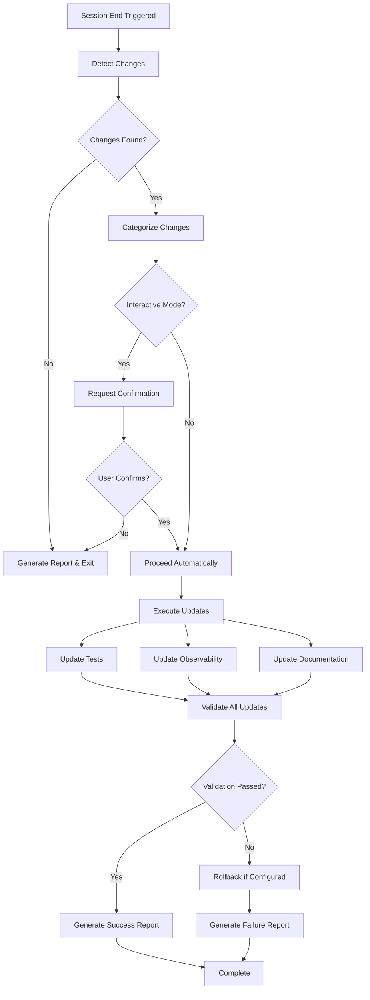

# Session-End Automation Capability

## Overview

This capability provides automated end-of-session updates for tests, observability configurations, and documentation. It analyzes repository changes and orchestrates appropriate updates across the entire project ecosystem using a tool-agnostic approach.

## Architecture

### Core Components

1. **Session Diff Detector** (`session-diff-detector.sh`)
   - Monitors git status and uncommitted changes
   - Identifies modified, added, and deleted files
   - Categorizes changes by type (terraform, scripts, config, docs, monitoring)
   - Detects critical changes requiring special attention
   - Outputs structured JSON for downstream processing

2. **Session Orchestrator** (`session-orchestrator.sh`)
   - Central controller for all automation operations
   - Manages execution flow and component coordination
   - Handles interactive, automatic, and dry-run modes
   - Performs validation and rollback operations
   - Generates comprehensive session reports

3. **Test Updater** (`test-updater.sh`)
   - Creates test files for new scripts
   - Updates existing test cases based on changes
   - Generates integration tests for significant modifications
   - Creates Terraform validation tests
   - Maintains test coverage alignment

4. **Observability Updater** (`observability-updater.sh`)
   - Updates Prometheus alerting rules
   - Creates/modifies Grafana dashboards
   - Adjusts AlertManager routing configurations
   - Updates logging configurations
   - Validates all monitoring configurations

5. **Documentation Updater** (`docs-updater.sh`)
   - Updates README.md with recent changes
   - Maintains capability documentation
   - Creates operational guides
   - Generates technical references
   - Produces session reports

## Workflow

### Execution Flow



### Trigger Methods

1. **Manual Invocation**
   ```bash
   ./session-end.sh
   ```

2. **Git Hook Integration**
   ```bash
   # .git/hooks/pre-commit
   ./session-end.sh --mode automatic --quick
   ```

3. **CI/CD Pipeline**
   ```yaml
   - name: Run Session Automation
     run: ./session-end.sh --mode automatic
   ```

4. **Scheduled Execution**
   ```bash
   # Crontab entry
   0 */4 * * * /path/to/session-end.sh --mode automatic
   ```

## Decision Logic

### Change Categorization

| File Pattern | Category | Test Update | Observability Update | Documentation Update |
|-------------|----------|-------------|---------------------|---------------------|
| `*.tf`, `*.tfvars` | terraform | Validation tests | Infrastructure alerts | Deployment guides |
| `*.sh`, `*.bat` | scripts | Unit tests | Process monitoring | Script documentation |
| `*.yml`, `*.json` | config | Config tests | Config validation | Config reference |
| `*.md`, `*.txt` | docs | No | No | Cross-references |
| `prometheus/*`, `grafana/*` | monitoring | Integration tests | Self-monitoring | Monitoring guides |

### Update Priority

1. **Critical**: Security-related files, production terraform, secrets
2. **High**: Infrastructure code, monitoring configs, API changes
3. **Medium**: Scripts, configuration files, utilities
4. **Low**: Documentation, examples, tests

## Configuration

### Configuration File

Location: `.session-automation/config.yml`

```yaml
version: 1.0
mode: interactive
components:
  - tests
  - observability
  - documentation
validation:
  require_tests_pass: true
  min_coverage: 80
rollback:
  strategy: atomic
  preserve_manual_changes: true
```

### Environment Variables

```bash
export SESSION_MODE=automatic
export COMPONENTS=tests,documentation
export DRY_RUN=true
export PROJECT_ROOT=/path/to/project
```

### Command-Line Options

```bash
# Interactive mode with all components
./session-end.sh --mode interactive

# Dry run for testing
./session-end.sh --dry-run

# Update specific components
./session-end.sh --components tests,documentation

# Quick automatic mode
./session-end.sh --quick
```

## Integration Points

### Git Integration

- Pre-commit hooks for automatic updates
- Post-merge hooks for consistency checks
- Branch protection rules validation

### CI/CD Integration

- GitHub Actions workflow support
- Jenkins pipeline integration
- GitLab CI compatibility
- Azure DevOps pipeline support

### IDE Integration

- VS Code task configuration
- JetBrains run configurations
- Terminal shortcuts and aliases

## Output Artifacts

### Session Reports

Generated in `docs/session-reports/` with:
- Timestamp and duration
- Changes detected summary
- Actions taken
- Validation results
- Configuration used

### Test Artifacts

- New test files in appropriate directories
- Updated test cases
- Integration test suites
- Test execution reports

### Observability Artifacts

- Prometheus rule files
- Grafana dashboard JSON
- AlertManager routes
- Logging configurations

### Documentation Artifacts

- Updated README.md
- Capability specifications
- Operational guides
- Technical references

## Error Handling

### Validation Failures

- Tests failing: Report specific failures
- Config invalid: Show validation errors
- Missing dependencies: List requirements

### Rollback Strategies

1. **Atomic Rollback**: Revert all changes on any failure
2. **Progressive Rollback**: Revert only failed components
3. **Manual Recovery**: Provide recovery instructions

### Recovery Procedures

```bash
# Manual rollback
git checkout -- .

# Selective rollback
git checkout -- tests/
git checkout -- docs/

# Reset to last known good state
git reset --hard HEAD
```

## Best Practices

### Do's

- ✅ Run in dry-run mode first for major changes
- ✅ Review session reports before committing
- ✅ Keep configuration in version control
- ✅ Use interactive mode when learning
- ✅ Validate changes before production deployment

### Don'ts

- ❌ Skip validation in production branches
- ❌ Ignore repeated automation failures
- ❌ Disable rollback mechanisms
- ❌ Run with uncommitted critical changes
- ❌ Mix manual and automated updates

## Performance Considerations

### Optimization Settings

```yaml
performance:
  parallel_execution: true
  max_workers: 4
  timeout_seconds: 600
  cache_enabled: true
```

### Resource Usage

- CPU: Low to moderate (parallel execution)
- Memory: < 100MB typical
- Disk I/O: Proportional to repository size
- Network: Minimal (validation only)

## Security Considerations

### Sensitive File Detection

- Automatic detection of secrets and credentials
- Warning on critical file modifications
- Exclusion patterns for sensitive paths

### Access Control

- Respect file system permissions
- No elevation of privileges
- Audit trail in session reports

## Troubleshooting

### Common Issues

1. **No changes detected**
   - Check git status
   - Verify working directory
   - Ensure proper git configuration

2. **Validation failures**
   - Review error messages
   - Check component logs
   - Verify dependencies

3. **Permission denied**
   - Check file permissions
   - Verify script executability
   - Review directory access

### Debug Mode

```bash
# Enable debug output
export DEBUG=true
./session-end.sh --mode interactive
```

## Future Enhancements

- [ ] Machine learning-based change classification
- [ ] Automated PR creation
- [ ] Semantic versioning support
- [ ] Multi-language test generation
- [ ] Cloud-native deployment updates
- [ ] Real-time collaboration features

## Support

For issues or questions:
- Review documentation in `docs/`
- Check session reports for details
- Enable debug mode for troubleshooting
- Consult operational guides